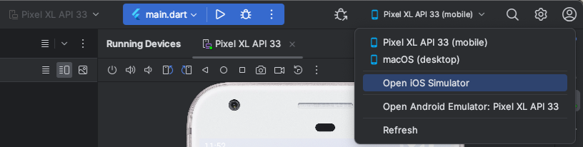

## Getting Started

This project is a starting point for a Flutter application.

## How to integrate this project in your IDE

- [xcode](https://docs.flutter.dev/get-started/install/macos#install-xcode) has to be installed for building an ios bundle and creating a virtual device
- Install flutter according to [this documentation](https://docs.flutter.dev/get-started/install/)
- Install [flutter](https://plugins.jetbrains.com/plugin/9212-flutter) and [dart](https://plugins.jetbrains.com/plugin/6351-dart) plugins for your IDE.
  - Android Studio is the recommended one.
- Under "Project Structure" the config should look somehow like this.

  

- go to the [pubspec.yaml](pubspec.yaml) file and click on "flutter doctor" in the upper bar or run the same command in a terminal.
  - When there are warnings remove them by following the steps.
- The IDE should not display any errors or warnings in general.

## Virtual Devices

### Android

- Open up the "Device Manager" and create a new device.
- In the list click on the "Play" Icon to run the device.
- under "Running devices" there is now a virtual Android running.

### IOS

- In the upper right hand corner find the combobox which contains the content of "open ios simulator"
- 

## Application Entrypoint

- [main.dart](lib%2Fmain.dart) contains the entrypoint of the application.
- to run on a virtual device the according device has to be started.
- running simultaneously  with hot deployment on android and ios is **not** possible.
